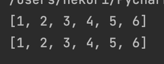
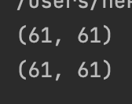

# Python. Лабораторная работа №2

# Условие задач: Функция для линеаризации вложенных списков linearize([1, 2, [3, 4, [5, [6, []]]]])  [1, 2, 3, 4, 5, 6] 
## Описание проделанной работы: 
## Скриншоты результатов:

# Условие задач: Функция для расчёта $a_k = 2b_k−1 + a_k−1; b_k = 2a_k−1 + b_k−1 * a_1 = b_1 = 1$
## Описание проделанной работы: 
## Скриншоты результатов:

## Ссылки на используемые материалы:
[Документация Python](https://www.python.org/doc/)
[Recursion in Programming](https://www.youtube.com/watch?v=IJDJ0kBx2LM)
[Рекурсивные функции](https://proglib.io/p/samouchitel-po-python-dlya-nachinayushchih-chast-13-rekursivnye-funkcii-2023-01-23)
[Как работает рекурсия](https://habr.com/ru/articles/337030/)
